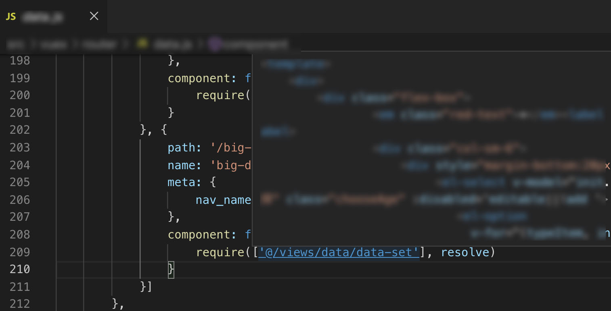

# Definition Resolve

跳转至定义，通过配置，处理路径快速跳转。（同 webpack 配置的 resolve）
> 默认读取工程根目录的`.resolve.conf.js`文件



## Extension Settings

Include if your extension adds any VS Code settings through the `contributes.configuration` extension point.

For example:

This extension contributes the following settings:

* `DefinitionResolve.open`: true 
    > Whether to turn on Definition Resolve.<br/>
    > 是否开启
* `DefinitionResolve.config.file.relative.path`: ".resolve.conf.js"
    > Relative path of resolve config file.(support‘js’/‘json’)<br/>
    > 配置文件的相对路径
* `DefinitionResolve.default.resolve`: 
    > Default resolve config.($root$ as workspace)<br/>
    > 在没有配置文件的情况下，使用的默认配置，其中可用‘$root$’作为工程根目录的占位符
    ```json
    {
        "extensions": [".js", ".vue", ".json"],
        "alias": {
            "vue$": "vue/dist/vue.esm.js",
            "@": "$root$/src"
        }
    }
    ```

**Enjoy!**
